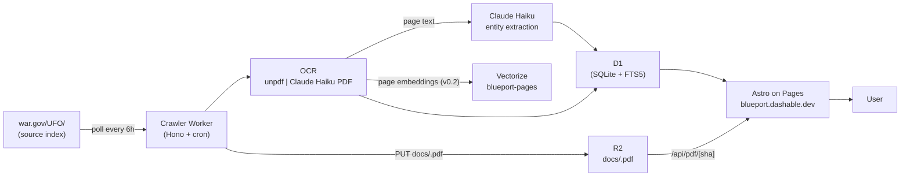
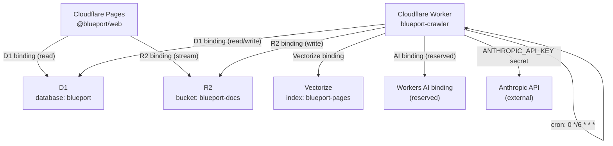

# Architecture

Blueport is a Cloudflare-native monorepo. The crawler Worker ingests, OCRs, and extracts metadata from government-released UAP/UFO PDFs; the Astro frontend reads from D1 and R2 to serve search, document pages, and RSS. Every component runs at the Cloudflare edge with no external infrastructure outside the Anthropic Claude API.

## System overview

## Data model

The schema lives in [`packages/db/src/schema.ts`](packages/db/src/schema.ts). The SQL migration that creates the tables, indexes, FTS5 virtual table, and sync triggers is [`packages/db/drizzle/0000_init.sql`](packages/db/drizzle/0000_init.sql).

### documents

One row per unique PDF, keyed by `sha256`. Stores provenance (`source_url`, `source_domain`, `fetched_at`, `http_status`, `r2_key`) alongside extracted metadata (`title`, `doc_type`, `page_count`, `document_date`, `incident_date`, `summary`). The `skeptic_take` and `analyst_take` columns are reserved for the v0.3 dual-take generator (Opus). `published_at` gates RSS visibility.

Indexes on `source_url`, `fetched_at`, and `document_date` cover the main query patterns (dedup lookup, chronological listing, date-range filtering).

### pages

One row per page per document. Foreign key to `documents.sha256` with `ON DELETE CASCADE` — dropping a document clears its pages automatically. The unique index on `(doc_sha, page_number)` prevents duplicates on re-ingestion. `ocr_model` records which path produced the text (`unpdf-textlayer` or `claude-haiku-4-5`). `has_redactions` is a boolean set during OCR by pattern match.

### entities

Named entities extracted by Claude Haiku. Foreign key to `documents.sha256` with `ON DELETE CASCADE`. `kind` is an enum: `person`, `location`, `unit`, `craft`, `sensor`, `date`. `value` preserves the string as it appears in the document; `normalized` stores the canonical form used for deduplication and cross-document linking. `lat`/`lng` are reserved for Phase 3 geocoding.

Indexes on `doc_sha`, `kind`, and `normalized` support per-document entity listing, kind filtering, and entity-level cross-document search.

### crawl_runs

One row per cron invocation. Records `started_at`, `finished_at`, `source_domain`, `new_documents`, `updated_documents`, and a JSON `errors` array. Used for monitoring and the "last verified" badge on document pages.

## Ingestion pipeline

Each step maps to a file and function in `apps/crawler/src/`.

1. **Fetch index** (`crawl.ts` → `runCrawl` → `fetchPolitely`): GET `SOURCE_INDEX_URL` with a single identifiable `User-Agent` header. No parallelism — one request at a time.

2. **Parse PDF links** (`crawl.ts` → `extractPdfUrls`): regex match on `href="*.pdf"` attributes, resolved against the base URL, deduplicated into a `Set`.

3. **Hash and dedup** (`crawl.ts` → `ingestDocument` → `sha256`): compute SHA-256 of the raw bytes via `crypto.subtle.digest`. Query D1 for the hash. If found, return `"unchanged"` and skip.

4. **Upload to R2** (`crawl.ts` → `ingestDocument`): `PUT docs/<sha256>.pdf` with `contentType: application/pdf` and custom metadata (`sourceUrl`, `fetchedAt`). Objects are never overwritten.

5. **OCR** (`ocr.ts` → `ocrPdf`): attempt `unpdf` text-layer extraction first (`tryTextLayer`). If average chars/page < 50, fall back to `claudePdfOcr` — sends the PDF as a base64 document block to Claude Haiku and parses `<page n="X">…</page>` tagged output.

6. **Redaction detection** (`ocr.ts` → `detectRedactions`): pattern match on `/\[REDACTED\]|████|■■■/` per page. Sets `pages.has_redactions`.

7. **Entity extraction** (`extract.ts` → `extract`): concatenated page text (first 50,000 chars) sent to Claude Haiku with a JSON schema prompt. Returns `title`, `docType`, `documentDate`, `incidentDate`, `summary`, and up to 30 entities.

8. **D1 writes** (`crawl.ts` → `ingestDocument`): insert one `documents` row, batch-insert `pages` rows, batch-insert `entities` rows. The FTS5 sync triggers in `0000_init.sql` keep `pages_fts` in lockstep automatically.

9. **Crawl run update** (`crawl.ts` → `runCrawl`): update the `crawl_runs` row with `finishedAt`, counts, and any errors.

## Hash-anchoring

Every PDF is stored at the path `docs/<sha256>.pdf`. The SHA-256 is computed from the raw bytes before any parsing, making it a content-addressed key that is independent of the source URL or fetch timestamp.

Consequences:

- If war.gov silently modifies a document (redacts more, corrects a date), the hash changes and Blueport ingests it as a new document. The old version remains in R2. Both are queryable.
- A document moved to a different URL but with identical content will match the existing hash and be skipped — dedup is content-based, not URL-based.
- R2 objects are immutable in practice. No `PUT` ever targets an existing key. The full history of a document's published forms is preserved as a sequence of hashes.

Phase 4 redaction archaeology depends on this: to find passages that were redacted in one release and unredacted in another, Blueport will diff the page text of two versions of the same logical document across their two hashes.

## OCR strategy

The pipeline uses a two-stage hybrid:

1. **`unpdf` text-layer** (free, ~0ms overhead): most Pentagon PDFs contain an embedded text layer from the original authoring tool. If the average character count per page exceeds 50, this text is used directly. Cost: zero.

2. **Claude Haiku PDF vision fallback** (~$0.001/page): for scanned documents with no text layer (or a sparse one), the raw PDF bytes are base64-encoded and sent to Claude Haiku as a `document` content block. Claude returns a structured page-tagged transcript. Cost at war.gov archive scale: estimated $1–5 total for the initial backfill.

Workers AI Llama 3.2 Vision is deferred to a future release. Cloudflare Workers have no native PDF rasterization service, and sending multi-page PDFs to a vision model requires per-page JPEG conversion that is not available in the Workers runtime today.

## Search

v0.1 ships BM25 full-text search via the `pages_fts` FTS5 virtual table created in `0000_init.sql`. The table is an external-content FTS5 backed by `pages`, with insert/delete/update triggers that keep it synchronized. The tokenizer is `porter unicode61`.

v0.2 will add Voyage-3 vector embeddings (768d, cosine) stored in the `blueport-pages` Vectorize index. Search will become hybrid: FTS5 BM25 score fused with Vectorize cosine similarity. The Vectorize binding is already declared in `apps/crawler/wrangler.toml` and the index is provisioned by `scripts/setup.sh`.

## Provenance and trust

Blueport's trust model rests on three properties:

- **Hash visibility**: every document page shows its SHA-256. A reader can download the original PDF from `/api/pdf/[sha]` and verify the hash independently.
- **Immutable R2 cache**: the `/api/pdf/[sha]` route streams the original bytes from R2 with `Cache-Control: public, max-age=31536000, immutable`. The URL is permanently stable because the content is content-addressed.
- **Open ingestion pipeline**: the code that fetches, hashes, OCRs, and extracts every document is this repository. An auditor can read `apps/crawler/src/` end to end and reproduce any ingestion result.

The "last verified against war.gov on YYYY-MM-DD" badge on each document page is sourced from the most recent `crawl_runs` row for the document's `source_domain`.

## Deploy topology

The cron trigger runs at `0 */6 * * *` (every 6 hours) and is declared in `apps/crawler/wrangler.toml`. The manual trigger endpoint `POST /admin/crawl` is authenticated via the `ANTHROPIC_API_KEY` header for operator use.

## Failure modes and mitigations

| Failure | Blast radius | Mitigation |
|---|---|---|
| war.gov rate-limits or blocks the crawler | Crawl run fails; no new docs ingested | Single User-Agent (`BlueportBot/0.1`), no parallelism, polite headers. Errors logged per URL in `crawl_runs.errors`. Retry on next cron tick. |
| OCR low-confidence on scanned pages | Pages indexed with sparse or garbled text | `ocr_confidence` column tracked; low-confidence pages flagged for human review in v0.2. |
| Anthropic API outage | Entity extraction and/or OCR fallback unavailable | Text-layer OCR succeeds independently. Documents with no text layer are skipped and retried on next cron run. |
| R2 write failure | Document not stored; ingestion aborts | Error recorded in `crawl_runs.errors`. Hash not written to D1. Next cron re-fetches and retries from scratch. |
| D1 write failure | Pages and entities not written | Partial write rolled back implicitly (D1 is SQLite). Re-ingestion is idempotent: hash dedup catches the retry. |
| Viral traffic spike driving R2 egress | Cost spike on PDF streaming | `Cache-Control: immutable` on `/api/pdf/[sha]`. Cloudflare CDN caches the response after first hit. No R2 egress on cache hits. |

## Decisions log

| Decision | Choice | Rationale |
|---|---|---|
| Infrastructure | Cloudflare-everything (Pages, Workers, D1, R2, Vectorize) | Single-vendor, zero-egress between services, generous free tier, cron triggers and R2 content-addressed storage are native fits for this use case. |
| Frontend framework | Astro over Next.js | Content-heavy static site with RSS. Astro's output model (HTML-first, island hydration) gives the fastest TTFB for a read-heavy archive. RSS generation is a first-class Astro endpoint. |
| License | AGPL-3.0-only | Ingestion pipeline correctness is a trust property. AGPL ensures any service operator running a fork must publish their modifications. |
| OCR | Hybrid unpdf + Claude Haiku | unpdf covers the majority of docs at zero cost. Claude Haiku PDF vision handles scans at ~$0.001/page. Workers AI Llama 3.2 Vision deferred: no PDF rasterization in the Workers runtime. |
| Auth | None in v0.1 | The archive is public domain source material. Adding auth before there is anything worth protecting creates friction with no benefit. Clerk deferred to v0.2 for saved searches and alerts. |
| Embeddings | Voyage-3 (planned, v0.2) | 768d, cosine metric. Anthropic's recommended embedding family for document corpora. Vectorize index and binding are pre-provisioned; wiring deferred until FTS5 search is validated at scale. |
